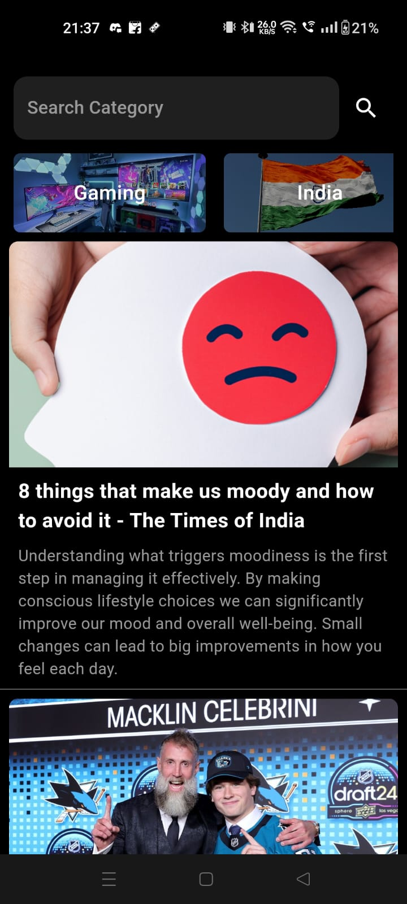

# Briefly

Welcome to **Briefly**, a news app designed to keep you informed quickly and easily. Built with Flutter and Dart, **Briefly** lets you explore the latest news across various categories.

With **Briefly**, you can stay updated on current affairs, technology, entertainment, sports, and more. You can search for topics or browse news through different categories to find what interests you.

The app's simple interface and smooth performance make it easy to read and navigate news articles. **Briefly** is here to help you stay informed without any hassle.


## Features

- **Category Search:** Effortlessly discover news articles by selecting from a wide range of categories.
- **Trending News:** Stay ahead with the most trending and significant news topics.
- **User-friendly Interface:** Experience a sleek, clean, and intuitive design for optimal navigation.
  
## Installation

To set up **Briefly** on your local machine, follow these instructions:

1. **Clone the repository:**
    ```bash
    git clone https://github.com/yourusername/briefly.git
    ```

2. **Navigate to the project directory:**
    ```bash
    cd briefly
    ```

3. **Install the necessary dependencies:**
    ```bash
    flutter pub get
    ```

4. **Run the application:**
    ```bash
    flutter run
    ```

## Screenshots

<div style="display: flex; flex-wrap: wrap;">
  
  
  
  
</div>

## Technical Stack

- **Framework:** Flutter
- **Language:** Dart
- **API:** News API for fetching the latest news articles, Gemini API for summarizing news articles
  
## License

This project is licensed under the MIT License. For more details, see the [LICENSE](LICENSE) file.

## Contact

For inquiries, feedback, or support, please reach out to us at [chsatyasavith@gmail.com](mailto:chsatyasavith@gmail.com) , [aryanrekhiworkmail@gmail.com](mailto:aryanrekhiworkmail@gmail.com) 
